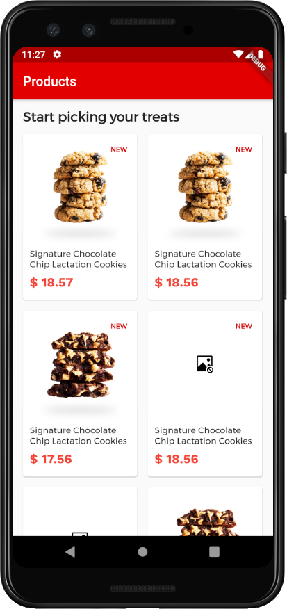
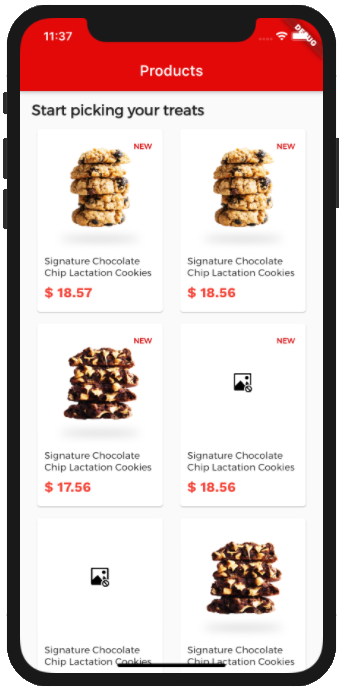
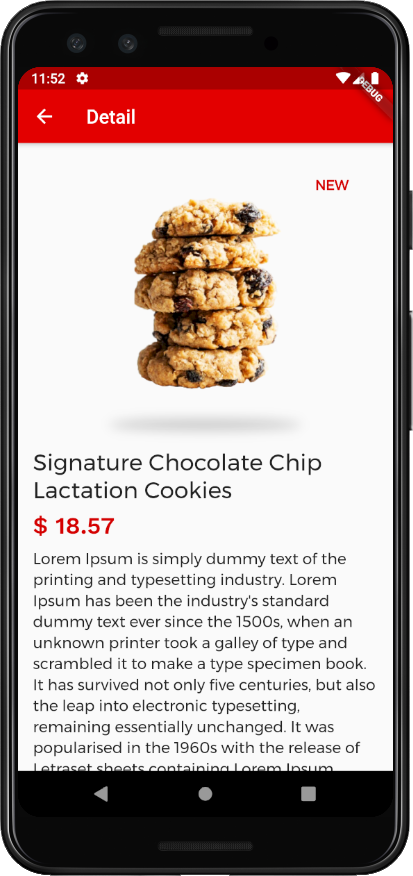
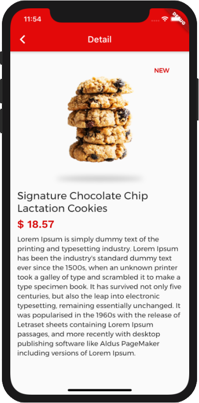

# Cookies E-commerce

A simple Cookies E-commerce App made with Flutter. This app uses Bloc pattern as a way to handle UI state and logic. It also implement simple network management and new Flutter transition: Container transform.

 <p float="left">
  
  
  
  
</p>

## Getting Started

### Clone this project and access it directory
```
git clone https://github.com/Cheersupzoo/cookies_e_commerce.git
cd cookies_e_commerce
```

### Install dependency
```
flutter pub get
```

### Run the app
```
flutter run
```
* For smooth animation, recommend run in release/profile mode

### Testing
```
flutter test
```